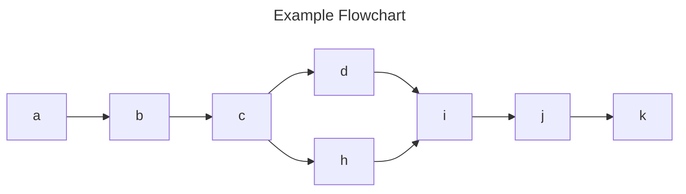

# 👋 Handy

[](https://jsr.io/@psk/handy) [](https://deno.land/x/handy)

Utility functions, classes, types, and scripts in uncompiled TS, for Deno.

- [`array`](#array)
- [`cli`](#cli)
- [`collection`](#collection)
- [`deno`](#deno)
- [`env`](#env)
- [`fs`](#fs)
- [`git`](#git)
- [`graph`](#graph)
- [`io`](#io)
- [`js`](#js)
- [`json`](#json)
  - [`Json` namespace](#json-namespace)
  - [`JsonMergePatch` namespace](#jsonmergepatch-namespace)
  - [`JsonPatch` namespace](#jsonpatch-namespace)
  - [`JsonPointer` namespace](#jsonpointer-namespace)
  - [`JsonTree` namespace](#jsontree-namespace)
- [`md`](#md)
- [`mermaid`](#mermaid)
- [`number`](#number)
- [`object`](#object)
- [`os`](#os)
- [`parser`](#parser)
- [`path`](#path)
- [`scripts`](#scripts)
  - [`makeReleaseNotes`](#makereleasenotes)
  - [`updateExports`](#updateexports)
- [`string`](#string)
- [`ts`](#ts)

## `array`

Array-related utilities.

```ts
import { mapOnInterval } from "jsr:@psk/handy/array";

const say = (item: unknown) => {/* No-op for demonstration */};

await mapOnInterval([3, 2, 1, "go!"], 1, say);
// say: 3
// 100ms later, say: 2
// 100ms later, say: 1
// 100ms later, say: "go!"
```

```ts
import type { Tuple, TypedArray } from "jsr:@psk/handy/array";

const arr: TypedArray = new Uint8Array();

type Filled = Tuple.Fill<["a", "b"], 7>; // [7, 7]
type Flattened = Tuple.Flat<[[1, 2], [3, 4]]>; // [1, 2, 3, 4]
type Indices = Tuple.Indices<["a", "b", "c"]>; // [0, 1, 2]
type Index = Tuple.Index<["a", "b", "c"]>; // 0 | 1 | 2
type Reversed = Tuple.Reverse<[1, 2, 3]>; // [3, 2, 1]
type Deed = Tuple.FromIndices<["d", "e"], [0, 1, 1, 0]>; // ["d", "e", "e", "d"]
type ThreeUnknowns = Tuple.OfLength<3>; // [unknown, unknown, unknown]
```

## `cli`

CLI-related utilities.

```ts
import { cmd, cmds, consoleWidth } from "jsr:@psk/handy/cli";

await cmd("deno -V"); // ex: "deno 1.34.0"
await cmds(["deno -V", "deno -h"]); // executes all and provides a summary of successes and failures
consoleWidth(80); // real width of terminal, or fallback of 80
```

## `collection`

Utilities related to generic collection types, like `Iterable`s.

```ts
import { largest, position, smallest } from "jsr:@psk/handy/collection";

largest(["aaa", "b", "cc"]); // "aaa"
smallest(["aaa", "b", "cc"]); // "b"

largest("size", [new Set([1]), new Set([2, 3]), new Set()]); // new Set([2, 3])
smallest("size", [new Set([1]), new Set([2, 3]), new Set()]); // new Set()

// a Position is a location between items in a collection
position.toPosition(-1, ["a", "b", "c"]); // 2, position between b and c
position.toPosition(-1, "abc"); // 2, position between b and c

// -0 is the end of the collection
position.toPosition(-0, ["a", "b", "c"]); // 3
position.toPosition(-0, "abc"); // 3

position.next(0, "a"); // 1, after a
position.next(1, "a"); // null, no next position exists
position.previous(1); // 0 (no collection needed)
position.previous(0); // null, no previous position exists

position.isPosition(NaN, []); // false
position.assert(0, []); // 0 is always valid
```

```ts
import { Index, IndexedCollection, Indices } from "jsr:@psk/handy/collection";

const arr = ["a", "b", "c"] satisfies IndexedCollection;
const str = "XY" satisfies IndexedCollection;
const typedArr = new Uint8Array() satisfies IndexedCollection;

type ArrIndices = Indices<typeof arr>; // [0, 1, 2]
type StrIndices = Indices<typeof str>; // [0, 1]
type TypedArrIndices = Indices<typeof typedArr>; // number[]

type ArrIndex = Index<typeof arr>; // 0 | 1 | 2
type StrIndex = Index<typeof str>; // 0 | 1
type TypedArrIndex = Index<typeof typedArr>; // number
```

## `deno`

Deno exports utilities.

```ts
import { coverage } from "jsr:@psk/handy/deno/coverage";
import { determine } from "jsr:@psk/handy/deno/exports/determine";

await determine("./_test/fixture/deno", {/* Options */});
// { ".": "./mod.ts", "some/path": "some/path.ts" }

await coverage().catch(() => {});
```

## `env`

Environment variable utilities.

```ts
import * as env from "jsr:@psk/handy/env";

env.boolean("MY_VAR"); // handles "false", "0", "", and undefined
env.number("MY_VAR"); // returns env var as a number or null
env.string("MY_VAR"); // returns env var as a string
```

## `fs`

File system-related utilities.

```ts
import { findNearestFile, glob, globImport } from "jsr:@psk/handy/fs";

await findNearestFile(".", "some.file"); // "../../some.file"
await glob("./**/*.ts"); // all TS files in cwd and subdirs

const modules = await globImport("./**/*.ts");

for (const [path, module] of Object.entries(modules)) {
  console.log(path); // something.ts
  const data = await module(); // import something.ts
}
```

Shortcuts for file system operations:

```ts
import {
  readJsonFile,
  replaceJsonFile,
  replaceTextFile,
  writeJsonFile,
} from "jsr:@psk/handy/fs";
// sync variants are also available
```

## `git`

Git-related utilities.

```ts
import { assertUnmodified, commit, tag } from "jsr:@psk/handy/git";

await tag.getLatest().catch(); // ex. "v1.0.0"

await commit.sha("HEAD").catch(() => {}); // ex. "a1b2c3d4e5f6..."
await commit.get("HEAD").catch(() => {}); // { message: "...", ... }
commit.conventional.parse("feat(scope)!: description"); // { type: "feat", ... }

await assertUnmodified().catch(() => {/* unstaged changes detected */});
await assertUnmodified("deno.json").catch(() => {/* can target files */});
```

## `graph`

Graph-related utilities.

```ts
import { DirectedGraph } from "jsr:@psk/handy/graph";

const graph = new DirectedGraph<string>()
  .add("a")
  .add("b", ["a", "c"]);

graph.vertices; // new Set(["a", "b", "c"])
graph.edges; // new Set([["a", "c"]])
```

## `io`

Assorted I/O utilities which don't fit in other categories.

> NOTE: Only supports MacOS and Windows

```ts
import { clipboard } from "jsr:@psk/handy/io";

await clipboard.copy("foo").catch(console.log);
await clipboard.paste().catch(console.log); // "foo"
```

## `js`

JavaScript utilities.

```ts
import { evaluate } from "jsr:@psk/handy/js";

const { stdout } = await evaluate("console.log('Hello!')");
//         ^? "Hello!"
```

## `json`

JSON-related utilities.

```ts
import { PrettyError } from "jsr:@psk/handy/json";

new PrettyError("Message", {/* A JSON object to pretty-print */});
```

### `Json` namespace

A convenience wrapper around baseline JSON utils and types. The utils are also available under `jsr:@psk/handy/json/utils`, and the types under `jsr:@psk/handy/json/types`.

```ts
import { Json } from "jsr:@psk/handy/json";

const a: Json.Primitive = "some string"; // or number, boolean, null
const b: Json.Array = [1, ["2", true], { a: null }];
const c: Json.Object = { a: 1, b: ["2", true], d: { e: null } };
// Json.Value = any of the above

const value = "example";

type T = Json.TypeName; // "string" | "number" | "boolean" | "null" | "object" | "array"
Json.typeOf(value); // returns a Json.TypeName
Json.shallowTypeOf(value); // doesn't check array/obj children

Json.clone(value);
Json.prettyPrint(value);
Json.minify(value);
Json.parse("{}");

Json.equals({ a: 1 }, { b: 2 }); // deep equality per JSON Patch spec

// Type guards
Json.isValue(value);
Json.isPrimitive(value);
Json.isArray(value);
Json.isObject(value);
Json.isObjectShallow(value); // confirms it's not null, Array, Map, Set, etc.
```

### `JsonMergePatch` namespace

Homegrown JSON Merge Patch utilities based on [the official spec](https://datatracker.ietf.org/doc/html/rfc7396).

```ts
import { assertEquals } from "@std/assert/equals";
import { JsonMergePatch } from "jsr:@psk/handy/json";

JsonMergePatch.MEDIA_TYPE; // "application/merge-patch+json"

// Diff to create a patch
const before = { A: 7, B: { C: true } };
const after = { A: 7, B: { D: ["Hello"] } };

assertEquals(
  JsonMergePatch.diff(before, after),
  { B: { C: null, D: ["Hello"] } },
);

// Apply patches
const target = { A: { B: { C: true } } };
const patch = { A: { B: { C: false, D: ["Hello"] } } }; // update C, insert D

JsonMergePatch.apply(target, patch); // Mutates target
```

### `JsonPatch` namespace

JSON Patch implementation based on [the official spec](https://datatracker.ietf.org/doc/html/rfc6902), and related utilities. See the module for more details.

### `JsonPointer` namespace

JSON Pointer implementation, with utilities, based on [the official spec](https://datatracker.ietf.org/doc/html/rfc6901). See the module for more details.

### `JsonTree` namespace

Homegrown utilities for working with JSON as a tree structure. See the module for more details.

## `md`

Markdown-related utilities.

````ts
import { codeBlock, fillCommentBlocks, table } from "jsr:@psk/handy/md";

codeBlock.create("grep"); // "    grep"
codeBlock.create("const a: number = 1", { lang: "ts" });
codeBlock.parse("```ts\nconst a: number = 1\n```");
codeBlock.findAll("    grep\n```cd```"); // ["    grep", "```cd```"]
codeBlock.evaluate(
  codeBlock.create('console.log("Hello!")', { lang: "ts" }),
);

fillCommentBlocks(
  `<!-- start my-block -->
<!-- end my-block -->`,
  { "my-block": "Content to fill the block" },
);

const [result, cursor] = table.parser.parse(
  `| Header 1 | Header 2 |
| -------- | -------- |
| Row 1    | Row 2    |
| Row 3    | Row 4    |`,
);
````

## `mermaid`

```ts
import { flowchart } from "jsr:@psk/handy/mermaid";
import { DirectedGraph } from "jsr:@psk/handy/graph";
import { codeBlock } from "jsr:@psk/handy/md";

const graph = new DirectedGraph<string>();

graph.add(["a", "b", "c", "d"], ["h", "i", "j", "k"], ["c", "h"], ["d", "i"]);

flowchart(graph.edges, { title: "Example Flowchart" }); //outputs mermaid flowchart markdown below
```



## `number`

Number-related utilities.

```ts
import { Num } from "jsr:@psk/handy/number";

type T = Num.Type<1.1>; // "+float"
type U = Num.Type<0>; // "zero"
type V = Num.Type<-5>; // "-integer"

// type filters return `never` if the type doesn't match
type Finite = Num.Finite<0>; // 0
type NotFinite = Num.Finite<number>; // never

type Wide = Num.Wide<number>; // number
type NotWide = Num.Wide<1>; // never

type Int = Num.Integer<1>; // 1
type NotInt = Num.Integer<1.1>; // never

type Float = Num.Float<1.1>; // 1.1
type NotFloat = Num.Float<1>; // never
```

## `object`

Object-related utilities.

```ts
import { setNestedEntry } from "jsr:@psk/handy/object";

const S = Symbol("symbol");
setNestedEntry({}, ["a", 10, S], "👋"); // { a: { 10: { [S]: "👋" } } }
```

```ts
import type { Obj } from "jsr:@psk/handy/object";

type Key = Obj.Key; // string | number | symbol
type Empty = Obj.Entry; // Record<Key, never>
type Entry = Obj.Entry<any>; // [Key, any]
type Pair = Obj.Pair<"a", number>; // { "a": number }
type EntryToPair = Obj.EntryToPair<Entry>; // Pair
type MyObj = Obj.FromEntries<[["a", 1], ["b", null]]>; // { a: 1, b: null }
type Entries = Obj.ToEntries<MyObj>; // Array<["a", 1], ["b", null]>
```

## `os`

OS-related utilities.

```ts
import { posixNewlines } from "jsr:@psk/handy/os";

posixNewlines("A\r\nB\rC"); // "A\nB\nC"
```

## `parser`

A parser combinator library.

```ts
import { sequence, string } from "jsr:@psk/handy/parser";

const dash = string("-").ignore;
const phoneNumber = sequence(/\d{3}/, dash, /\d{3}/, dash, /\d{4}/);

const [result] = phoneNumber.parse("123-456-7890");
//       ^? ["123", "456", "7890"]
```

## `path`

Path-related utilities.

```ts
import { dir, globRoot } from "jsr:@psk/handy/path";

dir(import.meta); // Node.js __dirname
dir("/path/to/file"); // "/path/to"
dir("C:\\\\a\\b\\c"); // "C:\\a\\b"

globRoot("a/b/**/*.ts"); // "a/b/"
```

## `scripts`

Each script supports CLI usage including a `--help` / `-h` flag, or a programmatic API.

### `makeReleaseNotes`

<!-- start make-release-notes -->

```
In a git repo, scan the commit history for conventional commits since the last tag and generate a markdown-formatted list of features and fixes.

Usage:
  deno run -A jsr:@psk/handy/script/makeReleaseNotes [options] [path]

Arguments:
  path    Path to a git repo to scan. Defaults to the current working directory.

Options:
  -h, --help          Show this help message
  -c, --to-clipboard  Copy release notes to clipboard
  -i, --inclusive     Include the first commit
  -v, --verbose       Print verbose output
  -g, --group-by-type Group commits by type using H2 headings
  --commit=<commit>   Commit to use as base for release notes
  --types=<types>     Comma-separated list of types to include
  --<type>=<name>     Name to use for a type's H2 when grouping by type

Examples:
  deno run -A jsr:@psk/handy/script/makeReleaseNotes -cgv

  deno run -A jsr:@psk/handy/script/makeReleaseNotes --commit v1.0.0

  deno run -A jsr:@psk/handy/script/makeReleaseNotes \\
    --types=feat,custom --custom="Custom's Section Heading"
```

<!-- end make-release-notes -->

### `updateExports`

<!-- start update-exports -->

```
Updates the exports field in a deno.json file to include .ts files in the current directory and its subdirectories, sorted by key. Excludes files and directories that start with a dot or underscore, and test files.

Usage:
  deno run -A jsr:@psk/handy/script/updateExports [path]

Arguments:
  path    A deno.json file or directory containing one. Searches the current directory by default.

Options:
  -h, --help         Show this help message
  -d, --dry-run      Show what would be done without making any changes
  -a, --assert       Returns exit code 1 if the file has unstaged changes after running the script. Defaults to true in CI and false otherwise.
  -r, --root=<path>  Make export paths relative to the provided path. Defaults to the deno.json file's directory.

Examples:
  deno run -A jsr:@psk/handy/script/updateExports.ts

  deno run -A jsr:@psk/handy/script/updateExports.ts ./path/to/deno.json

  deno run -A jsr:@psk/handy/script/updateExports.ts --root=src
```

<!-- end update-exports -->

## `string`

String-related utilities.

```ts
import {
  dedent,
  elideStart, // and others
  escapeTerse,
  indent,
  mostConsecutive,
  replaceMany,
  sequences,
  splitOn,
  splitOnFirst,
  Text,
  TextCursor,
} from "jsr:@psk/handy/string";

dedent("  a\n   b\n    c"); // "a\n b\n  c"
indent("a\nb\nc", 2); // "  a\n  b\n  c"
elideStart("1234567890", { maxLength: 8 }); // "…4567890"
escapeTerse("\t\t\n"); // "⇥⇥¶"
replaceMany("aabbcc", { a: "X", b: "Y" }); // "XXYYcc"
splitOnFirst("/", "a/b/c"); // ["a", "b/c"]
splitOn(3, "\n", "a\nb\nc\nd\ne"); // ["a", "b", "c", "d\ne"]
sequences("A", "ABAACA"); // ["A", "AA", "A"]
mostConsecutive("A", "ABAACA"); // 2

const text = new Text("a\nb\nc");
text.lines; // ["a\n", "b\n", "c"]
text.locationAt(4); // location of "c", { line: 3, column: 1, offset: 4 }
text.locationAt(5); // end of text, { line: 3, column: 2, offset: 5 }

const cursor = new TextCursor("a\nb\nc", 2);
cursor.remainder; // "b\nc"
cursor.location; // { offset: 2, line: 2, column: 1 }
cursor.inspect(); // string depicting...
// [L2] b¶
//       ^
```

```ts
import { Str } from "jsr:@psk/handy/string/types";

type Char = Str.Char<"ABC">; // "A" | "B" | "C"
type Index = Str.Index<"ABC">; // 0 | 1 | 2
type Indices = Str.Indices<"ABC">; // [0, 1, 2]
type Tuple = Str.ToTuple<"ABC">; // ["A", "B", "C"]
```

## `ts`

TypeScript-related utilities.

```ts
import { evaluate } from "jsr:@psk/handy/ts";

await evaluate("console.log('Hello!')")
  .then((res) => res.stdout); // "Hello!"
```

```ts
import type { Pretty, Satisfies } from "jsr:@psk/handy/ts";

type Input = { a: number } & { b: string };
//     ^? { a: number } & { b: string }

type Prettified = Pretty<Input>;
//     ^? { a: number; b: string }

type Str<T> = T extends string ? T : never;
type T = Satisfies<Str<"ABC">>; // true
type F = Satisfies<Str<123>>; // false
```
