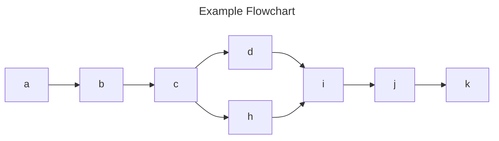

# 👋 Handy

[](https://jsr.io/@psk/handy) [](https://deno.land/x/handy)

Utility functions, classes, types, and scripts in uncompiled TS, for Deno.

- [`array`](#array)
- [`cli`](#cli)
- [`collection`](#collection)
- [`fs`](#fs)
- [`git`](#git)
  - [`script/makeReleaseNotes`](#scriptmakereleasenotes)
- [`graph`](#graph)
- [`io`](#io)
- [`js`](#js)
- [`json`](#json)
- [`md`](#md)
  - [`script/evalCodeBlocks`](#scriptevalcodeblocks)
- [`mermaid`](#mermaid)
- [`number`](#number)
- [`object`](#object)
- [`os`](#os)
- [`parser`](#parser)
- [`path`](#path)
- [`string`](#string)
- [`ts`](#ts)

## `array`

Array-related utilities.

```ts
import { mapOnInterval } from "https://deno.land/x/handy/array/mod.ts";

mapOnInterval([3, 2, 1, "go!"], 100, (item) => console.log(item));
// logs: 3
// 100ms later, logs: 2
// 100ms later, logs: 1
// 100ms later, logs: "go!"
```

```ts
import type {
  Tuple,
  TypedArray,
} from "https://deno.land/x/handy/array/types.ts";

const arr: TypedArray = new Uint8Array();

type Filled = Tuple.Fill<["a", "b"], 7>; // [7, 7]
type Flattened = Tuple.Flat<[[1, 2], [3, 4]]>; // [1, 2, 3, 4]
type Indices = Tuple.Indices<["a", "b", "c"]>; // [0, 1, 2]
type Index = Tuple.Index<["a", "b", "c"]>; // 0 | 1 | 2
type Reversed = Tuple.Reverse<[1, 2, 3]>; // [3, 2, 1]
type Deed = Tuple.FromIndices<["d", "e"], [0, 1, 1, 0]>; // ["d", "e", "e", "d"]
type ThreeUnknowns = Tuple.OfLength<3>; // [unknown, unknown, unknown]
```

## `cli`

CLI-related utilities.

```ts
import { cmd, consoleWidth } from "https://deno.land/x/handy/cli/mod.ts";

await cmd("deno -V"); // ex: "deno 1.34.0"
consoleWidth(80); // real width of terminal, or fallback of 80
```

## `collection`

Utilities related to generic collection types, like `Iterable`s.

```ts
import {
  largest,
  position,
  smallest,
} from "https://deno.land/x/handy/collection/mod.ts";

largest(["aaa", "b", "cc"]); // "aaa"
smallest(["aaa", "b", "cc"]); // "b"

largest("size", [new Set([1]), new Set([2, 3]), new Set()]); // new Set([2, 3])
smallest("size", [new Set([1]), new Set([2, 3]), new Set()]); // new Set()

// a Position is a location between items in a collection
position.toPosition(-1, ["a", "b", "c"]); // 2, position between b and c
position.toPosition(-1, "abc"); // 2, position between b and c

// -0 is the end of the collection
position.toPosition(-0, ["a", "b", "c"]); // 3
position.toPosition(-0, "abc"); // 3

position.next(0, "a"); // 1, after a
position.next(1, "a"); // null, no next position exists
position.previous(1); // 0 (no collection needed)
position.previous(0); // null, no previous position exists

position.isPosition(NaN, []); // false
position.assert(0, []); // 0 is always valid
```

```ts
import {
  Index,
  IndexedCollection,
  Indices,
} from "https://deno.land/x/handy/collection/types.ts";

const arr = ["a", "b", "c"] satisfies IndexedCollection;
const str = "XY" satisfies IndexedCollection;
const typedArr = new Uint8Array() satisfies IndexedCollection;

type ArrIndices = Indices<typeof arr>; // [0, 1, 2]
type StrIndices = Indices<typeof str>; // [0, 1]
type TypedArrIndices = Indices<typeof typedArr>; // number[]

type ArrIndex = Index<typeof arr>; // 0 | 1 | 2
type StrIndex = Index<typeof str>; // 0 | 1
type TypedArrIndex = Index<typeof typedArr>; // number
```

## `fs`

File system-related utilities.

```ts
import {
  findNearestFile,
  glob,
  globImport,
} from "https://deno.land/x/handy/fs/mod.ts";

await findNearestFile(".", "some.file"); // "../../some.file"
await glob("./**/*.ts"); // all TS files in cwd and subdirs

const modules = await globImport("./**/*.ts");

for (const [path, module] of Object.entries(modules)) {
  console.log(path); // something.ts
  const data = await module(); // import something.ts
}
```

## `git`

Git-related utilities.

```ts
import { assertUnmodified, commit, tag } from "./git/mod.ts";

await tag.getLatest().catch(console.log); // ex. "v1.0.0"

await commit.sha("HEAD").catch(console.log); // ex. "a1b2c3d4e5f6..."
await commit.get("HEAD").catch(console.log); // { message: "...", ... }
commit.conventional.parse("feat(scope)!: description"); // { type: "feat", ... }

await assertUnmodified(); // throws if there are unstaged changes
await assertUnmodified("deno.json"); // can check a specific file
```

### `script/makeReleaseNotes`

For a git repo, scan the commit history for conventional commits since the last tag and generate a markdown-formatted list of features and fixes.

```ts
import { makeReleaseNotes } from "https://deno.land/x/handy/git/script/makeReleaseNotes.ts";
```

When run as a script, it will generate release notes for the repo in the current working directory. The directory can be overridden by the first argument, and the `--to-clipboard` flag will copy the release notes to the clipboard instead of printing them to stdout.

```no-eval
Usage:
  deno run -A https://deno.land/x/handy/git/script/makeReleaseNotes.ts [options] [path]

Options:
  -h, --help          Show this help message
  -c, --to-clipboard  Copy release notes to clipboard
  -i, --inclusive     Include the first commit
  -v, --verbose       Print verbose output
  -g, --group-by-type Group commits by type using H2 headings
  --commit=<commit>   Commit to use as base for release notes
  --types=<types>     Comma-separated list of types to include
  --<type>=<name>     Name to use for a type's H2 when grouping by type

Examples:
  deno run -A https://deno.land/x/make_release_notes/mod.ts -cgv

  deno run -A https://deno.land/x/make_release_notes/mod.ts --commit v1.0.0

  deno run -A https://deno.land/x/make_release_notes/mod.ts \
    --types=feat,custom --custom="Custom's Section Heading"
```

## `graph`

Graph-related utilities.

```ts
import { DirectedGraph } from "https://deno.land/x/handy/graph/mod.ts";

const graph = new DirectedGraph<string>()
  .add("a")
  .add("b", ["a", "c"]);

graph.vertices; // new Set(["a", "b", "c"])
graph.edges; // new Set([["a", "c"]])
```

## `io`

Assorted I/O utilities which don't fit in other categories.

> NOTE: Only supports MacOS and Windows

```ts
import { clipboard } from "https://deno.land/x/handy/io/mod.ts";

clipboard.copy("foo").catch(console.log);
clipboard.paste().catch(console.log); // "foo"
```

## `js`

JavaScript utilities.

```ts
import { evaluate } from "https://deno.land/x/handy/js/mod.ts";

const { stdout } = await evaluate("console.log('Hello!')");
//         ^? "Hello!"
```

## `json`

Utility types.

```ts
import {
  JsonArray,
  JsonObject,
  JsonPrimitive,
  JsonValue,
} from "https://deno.land/x/handy/json/types.ts";

const a: JsonPrimitive = "some string"; // or number, boolean, null
const b: JsonArray = [1, ["2", true], { a: null }];
const c: JsonObject = { a: 1, b: ["2", true], d: { e: null } };
// JsonValue = any of the above
```

## `md`

Markdown-related utilities.

````ts
import { codeBlock } from "https://deno.land/x/handy/md/mod.ts";

codeBlock.create("grep"); // "    grep"
codeBlock.create("const a: number = 1", { lang: "ts" });
codeBlock.parse("```ts\nconst a: number = 1\n```");
codeBlock.findAll("    grep\n```cd```"); // ["    grep", "```cd```"]
codeBlock.evaluate(
  codeBlock.create('console.log("Hello!")', { lang: "ts" }),
);
````

### `script/evalCodeBlocks`

For a markdown file, execute each TS or JS code block in the file. Useful for checking imports and examples in a readme.

```ts
import { evalCodeBlocks } from "https://deno.land/x/handy/md/script/evalCodeBlocks.ts";
```

Code blocks can individually opt out of evaluation by placing `no-eval` in the [info string](https://spec.commonmark.org/0.30/#info-string).

````no-eval
```no-eval
Without language code.
```

```ts no-eval
console.log("With language code.");
```
````

When run as a script, it will execute the code blocks in the file specified by the first argument. The second and third arguments are optional, and are used to find and replace a string in the file before executing the code blocks.

```sh no-eval
deno run --allow-read --allow-run \
  https://deno.land/x/handy/scripts/evalCodeBlocks.ts \
  ./readme.md \
  "some string to find" "replacement string" # optional
```

## `mermaid`

```ts
import { flowchart } from "https://deno.land/x/handy/mermaid/mod.ts";
import { DirectedGraph } from "https://deno.land/x/handy/graph/mod.ts";
import { codeBlock } from "https://deno.land/x/handy/md/mod.ts";

const graph = new DirectedGraph<string>();

graph.add(["a", "b", "c", "d"], ["h", "i", "j", "k"], ["c", "h"], ["d", "i"]);

flowchart(graph.edges, { title: "Example Flowchart" }); //outputs mermaid flowchart markdown below
```



## `number`

Number-related utilities.

```ts
import { Num } from "https://deno.land/x/handy/number/types.ts";

type T = Num.Type<1.1>; // "+float"
type U = Num.Type<0>; // "zero"
type V = Num.Type<-5>; // "-integer"

// type filters return `never` if the type doesn't match
type Finite = Num.Finite<0>; // 0
type NotFinite = Num.Finite<number>; // never

type Wide = Num.Wide<number>; // number
type NotWide = Num.Wide<1>; // never

type Int = Num.Integer<1>; // 1
type NotInt = Num.Integer<1.1>; // never

type Float = Num.Float<1.1>; // 1.1
type NotFloat = Num.Float<1>; // never
```

## `object`

Object-related utilities.

```ts
import { setNestedEntry } from "https://deno.land/x/handy/object/mod.ts";

const S = Symbol("symbol");
setNestedEntry({}, ["a", 10, S], "👋"); // { a: { 10: { [S]: "👋" } } }
```

```ts
import type { Obj } from "https://deno.land/x/handy/object/types.ts";

type Key = Obj.Key; // string | number | symbol
type Empty = Obj.Entry; // Record<Key, never>
type Entry = Obj.Entry<any>; // [Key, any]
type Pair = Obj.Pair<"a", number>; // { "a": number }
type EntryToPair = Obj.EntryToPair<Entry>; // Pair
type MyObj = Obj.FromEntries<[["a", 1], ["b", null]]>; // { a: 1, b: null }
type Entries = Obj.ToEntries<MyObj>; // Array<["a", 1], ["b", null]>
```

## `os`

OS-related utilities.

```ts
import { posixNewlines } from "https://deno.land/x/handy/os/mod.ts";

posixNewlines("A\r\nB\rC"); // "A\nB\nC"
```

## `parser`

A parser combinator library.

```ts
import { sequence, string } from "https://deno.land/x/handy/parser/mod.ts";

const dash = string("-").ignore;
const phoneNumber = sequence(/\d{3}/, dash, /\d{3}/, dash, /\d{4}/);

const [result] = phoneNumber.parse("123-456-7890");
//       ^? ["123", "456", "7890"]
```

## `path`

Path-related utilities.

```ts
import { dir, globRoot } from "https://deno.land/x/handy/path/mod.ts";

dir(import.meta); // Node.js __dirname
dir("/path/to/file"); // "/path/to"
dir("C:\\\\a\\b\\c"); // "C:\\a\\b"

globRoot("a/b/**/*.ts"); // "a/b/"
```

## `string`

String-related utilities.

```ts
import {
  dedent,
  elideStart, // and others
  escapeTerse,
  indent,
  mostConsecutive,
  replaceMany,
  sequences,
  splitOn,
  splitOnFirst,
  Text,
  TextCursor,
} from "https://deno.land/x/handy/string/mod.ts";

dedent("  a\n   b\n    c"); // "a\n b\n  c"
indent("a\nb\nc", 2); // "  a\n  b\n  c"
elideStart("1234567890", { maxLength: 8 }); // "…4567890"
escapeTerse("\t\t\n"); // "⇥⇥¶"
replaceMany("aabbcc", { a: "X", b: "Y" }); // "XXYYcc"
splitOnFirst("/", "a/b/c"); // ["a", "b/c"]
splitOn(3, "\n", "a\nb\nc\nd\ne"); // ["a", "b", "c", "d\ne"]
sequences("A", "ABAACA"); // ["A", "AA", "A"]
mostConsecutive("A", "ABAACA"); // 2

const text = new Text("a\nb\nc");
text.lines; // ["a\n", "b\n", "c"]
text.locationAt(4); // location of "c", { line: 3, column: 1, offset: 4 }
text.locationAt(5); // end of text, { line: 3, column: 2, offset: 5 }

const cursor = new TextCursor("a\nb\nc", 2);
cursor.remainder; // "b\nc"
cursor.location; // { offset: 2, line: 2, column: 1 }
cursor.inspect(); // string depicting...
// [L2] b¶
//       ^
```

```ts
import { Str } from "https://deno.land/x/handy/string/types.ts";

type Char = Str.Char<"ABC">; // "A" | "B" | "C"
type Index = Str.Index<"ABC">; // 0 | 1 | 2
type Indices = Str.Indices<"ABC">; // [0, 1, 2]
type Tuple = Str.ToTuple<"ABC">; // ["A", "B", "C"]
```

## `ts`

TypeScript-related utilities.

```ts
import { evaluate } from "https://deno.land/x/handy/ts/mod.ts";

await evaluate("console.log('Hello!')")
  .then((res) => res.stdout); // "Hello!"
```

```ts
import type { Pretty, Satisfies } from "https://deno.land/x/handy/ts/types.ts";

type Input = { a: number } & { b: string };
//     ^? { a: number } & { b: string }

type Prettified = Pretty<Input>;
//     ^? { a: number; b: string }

type Str<T> = T extends string ? T : never;
type T = Satisfies<Str<"ABC">>; // true
type F = Satisfies<Str<123>>; // false
```
